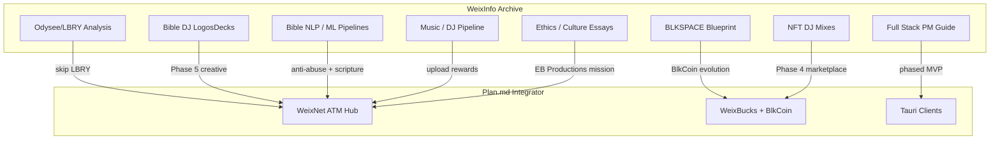

# Concepts Review — WeixInfo → BlkSpace

Full synthesis of 98 `weixinfo/` research notes reviewed against `plan.md`.  
**Date:** 2026-06-14

---

## Executive Summary

The weixinfo corpus is a **skills + creative-vision archive**, not a WeixNet specification. Only 3 of 98 files name BlkSpace/WeixNet directly. The integrator is `plan.md`, which chooses Nostr + Iroh + Tauri and defers Solana/devops.

**What weixinfo contributes most:**

1. **Creative product vision** — Bible DJ (LogosDecks), NFT DJ mixes, music pipeline
2. **Decentralized media lessons** — Odysee/LBRY post-mortem validates plan's stack choice
3. **Blockchain curiosity** — BLKSPACE blueprint Rust stubs (superseded by hub-first model)
4. **Solo dev discipline** — MVP thinking, full-stack awareness without over-building
5. **Mission & ethics** — B.L.A.C.K. uplift, cultural content, responsible AI/crypto

**What weixinfo does not cover:** Nostr event kinds, Iroh pinning, Tauri scaffold, node harvest economics, WeixBucks formulas. Those are now in `hub-theory.md`.

---

## Concept Map

---

## Top 10 Cross-Cutting Concepts

### 1. Rust for Core Systems
- **Sources:** BLKSPACE Blueprint, TempleOS-in-Rust guide, plan.md
- **Verdict:** Rust for P2P, crypto, economy engine. **Not** a custom OS — use Tauri.
- **Action:** Phase 1 Cargo workspace for hub crates.

### 2. Decentralized Media (Skip LBRY)
- **Sources:** Odysee analysis, BLKSPACE blueprint (IPFS mention)
- **Verdict:** LBRY is legacy. Nostr + Iroh is the path.
- **Action:** Documented in `features/decentralized-media.md`.

### 3. NFT + DJ Music Monetization
- **Sources:** NFT DJ Mix, Bible DJ, Music Playlist, Python DJ conversion
- **Verdict:** DJ mixes are first-class upload type; NFT in Phase 4; earn WeixBucks on upload in Phase 2.
- **Action:** `features/nft-dj-mixes.md`.

### 4. Bible as Structured Creative Data
- **Sources:** LogosDecks, Religious Text GUI, Genesis XML, myBibleNLP (external)
- **Verdict:** Scripture is a flagship creative vertical, not an afterthought.
- **Action:** `features/logos-decks.md` + `features/creative-pipeline.md`.

### 5. Token / Memecoin Economics
- **Sources:** BLKCOIN blueprint, NFT minting questions, plan.md WeixBucks/BlkCoin
- **Verdict:** Simulated first; two-tier system; transparent Nostr audit trail.
- **Action:** `hub-theory.md` token flows.

### 6. Solo Full-Stack Project Management
- **Sources:** Full Stack vs Minimal Development Needs
- **Verdict:** MVP at end of Phase 3; architectural awareness without building everything.
- **Key principles adopted:**
  - MoSCoW prioritization
  - Parking lot for scope creep
  - Git from day one
  - Weekly review cadence

### 7. AI/ML on Text + Tabular Data
- **Sources:** PySpark→LLM, DistillGPT2, tabular embeddings, NLP primers
- **Verdict:** Phase 5 Bible NLP seeding; ML-informed anti-abuse later.
- **Not MVP:** No LLM integration in Phase 1.

### 8. Cross-Platform Dev Environment
- **Sources:** LazyVim, OpenClaw homelab, macOS/Linux guides
- **Verdict:** Personal toolchain. **Defer homelab orchestration** until hub approved.
- **Conflict resolved:** OpenClaw homelab pushes early infra; plan.md says wait.

### 9. Cultural Uplift + B.L.A.C.K. Identity
- **Sources:** AA literature, ethics essays, scripture focus, personal statement
- **Verdict:** EB Productions mission is non-negotiable product identity.
- **Circles:** TSU/Black creative spaces as initial niche (plan.md open question).

### 10. Bottom-Up Hub Before Heavy Infra
- **Sources:** Odysee (broken incentives), OpenClaw (volatile ops), plan.md directive
- **Verdict:** Hub theory → simulated economy → clients → devops last.
- **Action:** This docs/ folder IS the Phase 0 deliverable.

---

## Contradictions Resolved

| Conflict | weixinfo position | plan.md position | Resolution |
|----------|-------------------|------------------|------------|
| LBRY vs modern P2P | Build on LBRY possible | Nostr + Iroh | **Nostr + Iroh** — see Odysee analysis |
| Proxmox / Cozystack / heavy PaaS | Blueprint pushes infra early | Defer devops | **Defer** — homelab notes archived for Phase 5+ |
| Custom Rust PoW blockchain | Blueprint has full chain code | Simulated SQLite economy | **Simulated first** — chain is Phase 4 BlkCoin only |
| Solana timing | Blueprint emphasizes Anchor | Phase 4 | **Phase 4** — agree |
| "No Rust yet" in plan | Blueprint has Rust Apr 2026 | Skills list | **Update mental model** — Rust learning started via blueprint |
| WeixNet naming | AI thought it was WeChat typo | User-coined ATM hub | **plan.md definition wins** |
| Schoolwork in corpus | 24 SQL/net/C++ files | Archive as bloat | **Catalog only** — skills transfer, not product features |

---

## Concept Categories — Keep vs Archive

### Implement (→ docs/features/)
- Bible DJ / LogosDecks
- NFT DJ mixes on WeixNet
- Decentralized media strategy
- Creative pipeline (music, scripture, video)
- Stack reconciliation

### Reference (skills, no dedicated spec)
- SQL/query patterns → leaderboard design
- TCP/networking → relay bandwidth assumptions
- Python ML pipelines → Phase 5 anti-abuse
- Web scraping legal → content ingestion guardrails

### Archive (not BlkSpace product work)
- C/C++ homework
- PS4 exploit, dog evolution, LAN play trivia
- macOS Ventura troubleshooting (unless blocking your dev machine)

### Mission (evergreen guardrails)
- Ethical AI essays → moderation policy
- Children's wellbeing → age-appropriate features
- Cultural respect → community guidelines

---

## Gaps Filled by This Implementation

| Gap in weixinfo | Filled by |
|-----------------|-----------|
| Nostr event model | `hub-theory.md` capability table |
| Node harvest economics | `hub-theory.md` node section |
| EB Productions definition | `hub-theory.md` |
| WeixBucks/BlkCoin flows | `hub-theory.md` token diagram |
| LogosDecks → BlkSpace link | `features/logos-decks.md` |
| BLKCOIN blueprint → plan bridge | `features/stack-reconciliation.md` |

---

## Recommended Next Steps

1. Review `hub-theory.md` open decisions
2. Reply **approved** + niche preference (TSU/creative first?)
3. Phase 1: Tauri scaffold + Nostr keygen + stub economy events
4. Seed `assets/` with B.L.A.C.K. branding from hotencoderpy (external)
5. Keep weixinfo/ as read-only archive — do not delete

---

## Source File Index

Full categorized list: [weixinfo-catalog.md](./weixinfo-catalog.md)