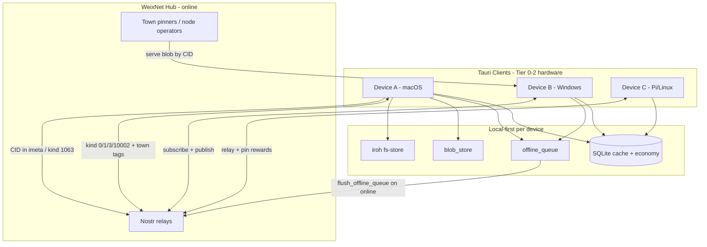

# BlkSpace Mesh Architecture (Practical Plan)

**Status:** Draft — aligned with shipped code (2026-06-16)  
**Related:** `plan.md`, `IROH_INTEGRATION.md`, `REAL_NOSTR_RELAYS.md`, `DEVICE_MESH_TESTING.md`

---

## Executive summary

**BlkSpace “mesh” is practical when defined correctly:** multi-device account sync, offline-tolerant social, and low-end node participation — **not** a separate BLE/libp2p peer mesh.

What already works (automated proof):

| Layer | Tech | Status |
|-------|------|--------|
| Identity | Nostr keys + BIP39 recovery + SQLite session | ✅ Shipped |
| Social gossip | Nostr relays (kind 0/1/3/10002 + town tags) | ✅ 5/5 smoke |
| Content | Iroh CID + local `blob_store` fallback | ✅ 6/7 (P2P manual open) |
| Offline | SQLite `offline_queue` + `flush_offline_queue` | ✅ Shipped |
| Security | Signed ingest, user-key publish, MIDF badges | ✅ Shipped |

What is **aspirational and should be deferred** for MVP:

- BLE “local mesh” (mentioned in `DEVICE_MESH_TESTING.md` §3.2) — no code, high platform cost, poor fit for media
- Parallel **libp2p** stack (research notes in `weixinfo/`) — duplicates Nostr; not in codebase
- Internet-free dorm propagation as **primary** transport — niche; use **cache + queue** instead

**Recommendation:** Ship **Hub Sync Mesh** (Nostr + Iroh + offline queue). Treat true device-to-device P2P as Phase 2+ enhancement.

---

## Terminology

| Term | Meaning in BlkSpace |
|------|---------------------|
| **Mesh** | Same account on multiple desktops; yards stay in sync via relays when online |
| **Hub** | Public Nostr relays + optional town pinners (Iroh CIDs) |
| **Harvest node** | Low-end machine running Tauri: relay connection, blob pin/serve, earn WB |
| **Offline** | Read cached feed/media; queue writes; flush to relays on `online` |

---

## Architecture (three layers + offline shell)

### Layer 1 — Identity & account portability

- **Keys:** Nostr secp256k1; stored in OS keychain via Tauri `KeyStore`
- **Recovery:** 12-word BIP39 → same `pubkey` on any device
- **Session:** SQLite + in-memory session map; no cloud account server

**Cross-device rule:** Same mnemonic = same Nostr identity = same feed once relays sync.

### Layer 2 — Social gossip (primary sync path)

- **Transport:** WebSocket Nostr relays (`relay_manager.rs`)
- **Publish:** User's real key only (`user_nostr_keys_for_publish`)
- **Ingest:** `ingest_validated_relay_event` (signature + canonical event id)
- **Town filter:** `t:hbcu-town:*` tags on kind 1
- **Background:** 60s poll for subscribed towns
- **NIP-65:** Relay lists for discoverability (Relays UI + profile card)

**This is how Device A → Device B post sync works today** (target &lt;60s with relays connected).

### Layer 3 — Content (media mesh)

- **Upload:** `upload_blob` → local hash + Iroh CID (`iroh` feature)
- **Reference:** Nostr note tags (`imeta`, `cid`, kind 1063 blob announce)
- **Fetch:** `get_blob_bytes` — Iroh CID first, local `blob_store` fallback
- **Multi-device today:**
  1. **Best:** Recover account on B; media metadata on relays; fetch by CID when network available
  2. **Dev/proof:** Copy `blobs/` + SQLite CID rows (`test_iroh_two_device_roundtrip_blob_store_sync`)
  3. **Future:** Live Iroh P2P between unrelated devices (netwatch platform gaps)

### Offline shell

- **Queue:** `queue_offline_action` → `flush_offline_queue` (posts, likes, replies, follows)
- **UI:** `OfflineSyncProvider` — flush on `online` + every 60s
- **Cache:** `offline_cache`, `prefetch_content`, `sync_account_content`
- **Observability:** `device_sync_log`, Mesh Test page

---

## Practicality assessment

### ✅ Aligned with project goals

| Goal (from `plan.md`) | How mesh delivers |
|------------------------|-------------------|
| Low-end hardware nodes | Tauri desktop on 4GB Windows; relay + pin only (no heavy transcoding yet) |
| Decentralized social | Nostr relays; no BlkSpace central server |
| Media like YT/MySpace | Iroh CID + local playback; pin rewards for harvesters |
| WeixBucks economy | Rewards on publish/engage; node pin/serve; daily cap |
| Bottom-up hub | Clients are thin; relays + pinners are the hub |
| HBCU towns | Town-tagged gossip; yard communities |

### ⚠️ Gaps (honest)

| Gap | Impact | Mitigation |
|-----|--------|------------|
| Live Iroh P2P across devices | Media may not appear on B without relay/copy | NIP-94/1063 on relays; pin popular CIDs |
| No LAN sync without internet | Offline = read-only + queued writes | Accept for MVP; LAN optional later |
| Android/mobile Tauri | Device D in test matrix not proven | Desktop-first; Damus for Nostr read-only check |
| BLE mesh in test doc | Implies feature that doesn't exist | Mark deferred in this doc |

### ❌ Not practical near-term

- **BLE mesh** for post distribution — Tauri has no cross-platform BLE gossip; battery/range limits; cannot carry video economically
- **libp2p parallel network** — two gossip layers (Nostr + libp2p) increases attack surface and dev cost
- **Syncthing/Tailscale as required** — nice optional for power users, not MVP dependency

---

## Phased implementation plan (existing tech only)

### Phase M0 — Sign off what exists (1–2 days, manual)

**Goal:** Prove multi-device viability without new code.

| Step | Devices | Pass criteria |
|------|---------|---------------|
| M0.1 Account recovery | A creates, B recovers BIP39 | Same handle, balance, posts |
| M0.2 Relay sync | A posts, B on same Wi‑Fi + relays | Post on B feed &lt;60s |
| M0.3 Offline queue | B offline → post → online | `flush` publishes; no duplicate id |
| M0.4 Media | A uploads media post | B sees post text; media via CID or local cache |
| M0.5 Tier 0 | Windows 4GB laptop | Sync Test → Performance targets §4.1 |

**Commands:** `pnpm test:iroh`, `pnpm test:nostr-relay`, Sync Test UI

### Phase M1 — Harden hub sync ✅ (shipped `aa3f63b`)

**Goal:** Close gaps without new protocols.

| Item | Status |
|------|--------|
| Relay-first media discovery — kind 1063 + `cid` on every `upload_blob` | ✅ |
| Flush polish — replies publish to Nostr on `flush_offline_queue` | ✅ (likes: DB only; kind 7 deferred) |
| Sync UX — relay count, pending queue, town sync, Flush Now, M0 checklist | ✅ Sync Test |
| Device sync log — account/relay/flush → `device_sync_log` | ✅ |
| Persist `device_id` in Rust | ⏳ still `localStorage`; optional M1.5 |

### Phase M2 — Optional LAN assist (5–8 days, code)

**Goal:** Faster blob transfer on same dorm LAN **without** BLE.

**Option A (recommended):** Document **manual folder sync** (`blobs/` + app data path) for Tier 0 labs — zero new deps.

**Option B:** Lightweight **LAN blob offer** — Tauri discovers peers via mDNS; HTTP serve `blobs/` read-only on port; pull by hash/CID. Still uses Nostr for social ordering.

**Do not build:** BLE, libp2p, custom gossip.

### Phase M3 — Live Iroh P2P (platform-dependent)

**Goal:** Device B fetches CID from Device A without copy/relay.

- Track iroh/netwatch stability on Windows Tier 0 + macOS
- Enable when `IrohNode` can dial across NAT (may need relay node or town pinner always-on)
- Reward pin operators who serve cross-town CIDs (already stubbed: `report_pin_serve`)

### Phase M4 — Mobile read path (optional)

- Damus / Amethyst as **read-only** Nostr viewers for visibility tests
- Tauri Android when stable — same three-layer stack, no separate mesh

---

## Device roles (practical matrix)

| Device | OS | Tier | Role | Minimum tests |
|--------|-----|------|------|----------------|
| A | macOS | 2 | Dev + primary account | Create, publish, upload |
| B | Windows 10 | 0 | Student laptop sign-off | M0 + Tier 0 benchmarks |
| C | Linux / Pi 4 | 1 | Relay harvester | Connect defaults, pin serve, uptime rewards |
| D | Phone | 1 | Nostr reader (Damus) | Visibility test note |

Any **second desktop** substitutes for B/C for M0.1–M0.3.

---

## Success criteria (mesh = done)

| # | Criterion | Auto | Manual |
|---|-----------|------|--------|
| 1 | Same account on 2 devices via BIP39 | ✅ `/recover` | ⏳ M0.1 |
| 2 | Post sync &lt;60s via relays | ✅ `test_nostr_*` | ⏳ M0.2 |
| 3 | Offline post flushes without duplicate | ✅ queue + M1 reply Nostr | ⏳ M0.3 |
| 4 | Media portable via CID + cache | ✅ `pnpm test:iroh` + M1 kind 1063 | ⏳ M0.4 |
| 5 | Tier 0 performance | ✅ `pnpm test:tier0` dev Mac | ⏳ Device B |
| 6 | No data loss on sync | ✅ DB + rate-limit tests | ⏳ M0 stress |

**Score today:** 0/6 manual · 6/6 auto backbone (`aa3f63b`).

---

## Doc & UI alignment (2026-06-16)

- [x] `DEVICE_MESH_TESTING.md` — Phase 3 rewritten (offline queue); BLE → §3.4 deferred
- [x] `phase-0-status.md` — M0 matrix + architecture doc index
- [x] `IROH_INTEGRATION.md` / `REAL_NOSTR_RELAYS.md` / `plan.md` — cross-links
- [x] UI — Mesh Test → **Sync Test**; relay-focused copy on feed/landing/sidebar
- [x] M1 — `publish_blob_announce`, `publish_reply_to_nostr`, Sync Test flush/relay UX (`aa3f63b`)
- [ ] `weixinfo/` libp2p guides — reference only; not BlkSpace MVP path (no edit)

---

## Next actions (ordered)

1. Run **M0 manual matrix** on Device A + second desktop (`DEVICE_MESH_TESTING.md` Phases 1–3, §4.1)
2. **Device B Tier 0** — Sync Test → Performance; mark §4.1 manual column
3. Optional **M1.5** — persist `device_id` in Rust keychain/SQLite
4. Revisit **M2 LAN** only if dorm offline blob transfer is a hard requirement

---

*This plan intentionally uses only Nostr, Iroh, SQLite, and Tauri — the stack already in `Code-Companion/artifacts/blkspace`. No new networking crate required for MVP mesh.*