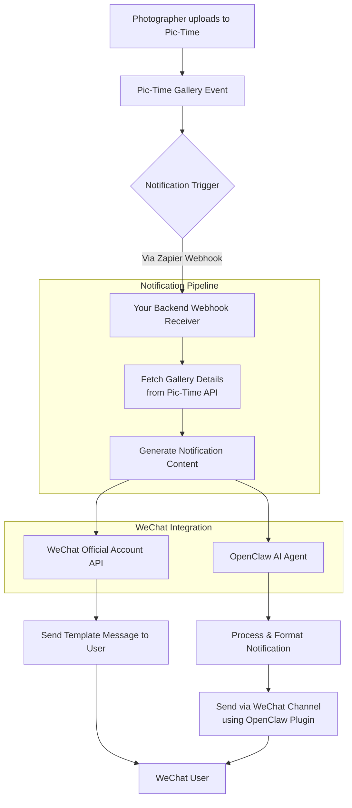

# OpenClaw and DeepSeek OpenCode LazyVim Integration Guide

**Created:** 4/28/2026, 4:55:26 AM
**Updated:** 4/28/2026, 5:04:52 AM
**Exported:** 6/13/2026, 4:05:00 AM
**Link:** [https://chat.deepseek.com/a/chat/s/e7de849e-7eae-43e4-8d70-4248921664ce](https://chat.deepseek.com/a/chat/s/e7de849e-7eae-43e4-8d70-4248921664ce)

---

## User
**2026-04-28T10:01:15.205Z**

what is openclaw and how can i use deepseek and opencode and lazyvim and openclaw all in one solodev techstack

## DeepSeek
**2026-04-28T10:01:15.207Z**

### Thinking
````
The user is asking about "openclaw" and how to use DeepSeek, OpenCode, LazyVim, and OpenClaw together in a solo dev tech stack. I need to first understand what OpenClaw is. I'll search for it.

Relevant pages found.

The search results show OpenClaw is an open-source AI agent platform. The user wants to know how to use DeepSeek, OpenCode, LazyVim, and OpenClaw together. I need to gather information about each component and how they can be integrated. I'll open the relevant links.

Page browsed.

Page browsed.

Page browsed.

Page browsed.

Page browsed.

Page browsed.

Page browsed.

Page browsed.

Page browsed.

Page browsed.

Page browsed.

Now I need to gather information about LazyVim. I'll search for it.

Relevant pages found.

Now I need to understand "OpenCode". I'll search for it.

Relevant pages found.

Let's open the DeepSeek API docs for OpenCode and OpenClaw integration.

Page browsed.

Now I have a good understanding of the components. I need to explain OpenClaw and how to use all four together. I'll structure the answer: first, explain each tool, then discuss integration. I'll cite relevant sources.
````

You can think of this stack as building a **two-layer partnership**: OpenClaw acts as your autonomous "backend" agent, while LazyVim paired with an AI coding tool like OpenCode serves as your interactive "frontend" IDE for writing code. Let's break down each part and how they mesh together.

### 🧩 A Quick-Start Guide to Your Solodev Techstack

Here is a breakdown of each component and its role in your workflow, along with a simple installation guide to get you started quickly.

| 🖥️ Component | ✍️ Role (The "What") | 🛠️ Quick Setup (The "How") |
| :--- | :--- | :--- |
| **LazyVim (Your IDE)** | The interactive editing layer. Turns Neovim into a modern, full-featured IDE with a file tree, fuzzy finder, and AI integration. | `git clone https://github.com/LazyVim/starter ~/.config/nvim` |
| **DeepSeek (Your AI Engine)** | The brain behind the tools. A powerful, cost-effective language model that can generate code, execute plans, and hold complex conversations. | Get an API key from the DeepSeek Platform. This will be used by your other AI tools. |
| **OpenCode (Your AI Copilot)** | The in-editor AI assistant. Directly in your terminal, it helps with code completion, debugging, and context-aware refactoring. | `npm install -g @anthropic-ai/claude-code` (Uses the Claude Code interface, configured for DeepSeek) |
| **OpenClaw (Your Autonomous Agent)** | Your personal AI "employee". A self-hosted agentic platform that can automate complex, multi-step tasks across different apps and services. | `curl -fsSL https://openclaw.ai/install.sh \| bash` (macOS/Linux) |

A bit more detail on why each piece matters:

*   **LazyVim** is a pre-configured Neovim setup that gives you IDE-like features without the bloat[reference:0]. Its power comes from lazy-loading plugins, making it incredibly fast and customizable[reference:1]. It even includes extras for integrating AI tools like Copilot[reference:2], making it the perfect home for OpenCode.
*   **OpenCode** is your open-source, model-neutral AI coding assistant that lives in the terminal[reference:3]. Unlike some AI tools, it's not tied to a single model provider, meaning you can use it with DeepSeek, Claude, or GPT-4[reference:4]. It provides a chat-style agent that helps you write, debug, and understand code faster[reference:5].
*   **DeepSeek** acts as the high-performance "brain" for both OpenCode and OpenClaw. By getting a DeepSeek API key, you can plug this powerful model into your tools[reference:6][reference:7]. It's known for its strong performance in code generation and reasoning.
*   **OpenClaw** is fundamentally different from a code editor. It's an **autonomous, self-hosted AI agent** that you can think of as your "employee"[reference:8][reference:9]. You can give it broad, multi-step goals via messaging apps like Telegram or WeChat, and it will figure out the steps and execute them on your computer[reference:10]. This could be anything from "find the bug in this codebase and submit a PR" to "read and summarize my emails every morning."

---

### 🤖 How Your Stack Works Together

The key is seeing these not as separate tools, but as a two-layered system:

*   **Layer 1: Interactive Coding (LazyVim + OpenCode + DeepSeek)**: This is where you, the developer, write code line by line. OpenCode is your AI pair programmer, integrated directly into LazyVim. It understands your project context and can suggest code, debug errors, or even refactor entire functions on demand, all powered by DeepSeek.
*   **Layer 2: Autonomous Workflow (OpenClaw + DeepSeek)**: This is your AI "employee" that automates tasks *around* your coding. A practical workflow looks like this:
    1.  You're working on a feature in LazyVim but hit a complex bug.
    2.  Instead of manually debugging, you send a message to OpenClaw: "Find the root cause of the checkout bug, fix it, and submit a PR."
    3.  OpenClaw, using its `coding` toolset, will read your file system, execute commands, analyze code, create a new branch, write the fix, and submit a pull request—all autonomously[reference:11][reference:12].
    4.  This frees you to keep coding on other features in LazyVim with OpenCode's help. You can interact with OpenClaw through a chat app or even directly from LazyVim via the MCP protocol[reference:13].

This setup—a responsive local IDE for focused work and an autonomous task executor for the heavy lifting—lets you comfortably tackle the level of complexity that would normally require an entire team.

If you'd like to dive deeper into any of these tools—like setting up OpenClaw with specific channels or configuring LazyVim's AI extras—feel free to ask.

## User
**2026-04-28T10:04:02.222Z**

make a project that involves making an end to end basic photo website portfolio that can be used to notify when a new photo album has been uploaded to pictime for easy access but will also be integrated to weixnet server

## DeepSeek
**2026-04-28T10:04:02.224Z**

### Thinking
````
The user wants to build a photo portfolio website with specific integrations. I need to research the mentioned services and technologies to provide accurate guidance. The plan includes two rounds of searches. I'll start with Round One to gather information about Pic-Time, WeChat/Weixin server integration, OpenClaw, OpenCode, and DeepSeek API.

Relevant pages found.

After the first round of searches, I have gathered some initial information. I need to open some of the more promising results to get more details. I'll open the Pic-Time help center pages, the WeChat developer documentation, the OpenClaw WeChat integration articles, and the DeepSeek API documentation.

Page browsed.

Page browsed.

Page browsed.

Page browsed.

Page browsed.

Page browsed.

Page browsed.

Page browsed.

After the second round of searches, I have a better understanding of the integration points. For the second round, I need to search for more specific topics: Pic-Time notification automation, WeChat messaging APIs, and framework options for the portfolio site.

Relevant pages found.

Now I have a good understanding of the various components. I need to structure the answer. The user's request is to build a project, so the response will be a project plan. I'll cover the architecture, tech stack choices, and implementation steps.
````

This is an excellent project that brings together several modern tools. I've outlined a development plan and architecture that shows exactly how this system can be built.

Here is a summary of the main technologies you'll use for this project:

| 🛠️ Technology | 🎯 Role in the Project |
| :--- | :--- |
| **Astro** | Builds the main, high-performance portfolio website. |
| **DeepSeek API** | Provides the intelligence for automating tasks and notifications. |
| **OpenClaw** | Listens for events and calls the DeepSeek API to generate and send WeChat notifications. |
| **LazyVim / OpenCode** | Your development environment for writing all the project's code. |

### 🏗️ System Architecture & Data Flow
The system works as a cohesive pipeline. Here's how the different parts will connect:



### 💻 Tech Stack & Implementation Plan
Let's break down the project into its main components, starting with your development environment and the core portfolio site, then moving to the notification system and WeChat integration.

* **Step 1: Your Dev Environment (LazyVim + OpenCode + DeepSeek)**: You can set up your Dockerized dev environment that auto-launches LazyVim and OpenCode, letting you start coding with AI assistance immediately upon entering the container. For OpenCode, you'll integrate it with the **DeepSeek API**, which will serve as the reasoning engine for both OpenCode and OpenClaw[reference:0][reference:1].

* **Step 2: The Portfolio Website (Astro)**: Since your content is on Pic-Time and you likely have a small number of pages, **Astro** is the perfect choice. It will produce a website that's incredibly fast, highly secure, and very easy to deploy. You can pick from photography-specific Astro templates to get started quickly[reference:2]. To add Pic-Time galleries, simply copy the embed code from your Pic-Time gallery settings and paste it directly into an Astro component's HTML block[reference:3].

* **Step 3: The Notification System (Zapier + DeepSeek + OpenClaw)**: The notification system will be the project's automation powerhouse. You'll use a no-code tool like **Zapier** or **Pic-Time Automations** to listen for Pic-Time's "New Gallery Published" event[reference:4][reference:5]. When an event is detected, you have two powerful options: a backend service that programmatically composes a message and sends it to WeChat, or an **OpenClaw agent** that handles the entire creation and notification process autonomously. Both options will use **DeepSeek** as their underlying AI engine[reference:6][reference:7].

* **Step 4: WeChat Integration (Official Account API + OpenClaw Plugin)**: You'll use the **WeChat Official Account API** to send a structured template message to notify your followers about new albums[reference:8][reference:9]. To accept user messages and provide services, you'll need to host a backend server that interfaces with WeChat's callbacks[reference:10]. Alternatively, you can leverage the power of **OpenClaw** by using a dedicated WeChat channel plugin. This allows for a much simpler and faster setup, connecting your personal WeChat to OpenClaw's AI gateway in under five minutes[reference:11][reference:12][reference:13].

We have a clear and actionable path forward. Which step would you like to start with? I can help you get your development environment running with LazyVim and OpenCode, or we can begin scaffolding the Astro portfolio site.

