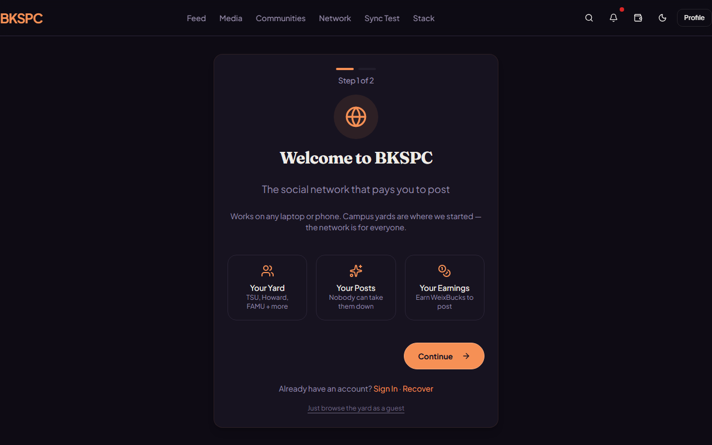
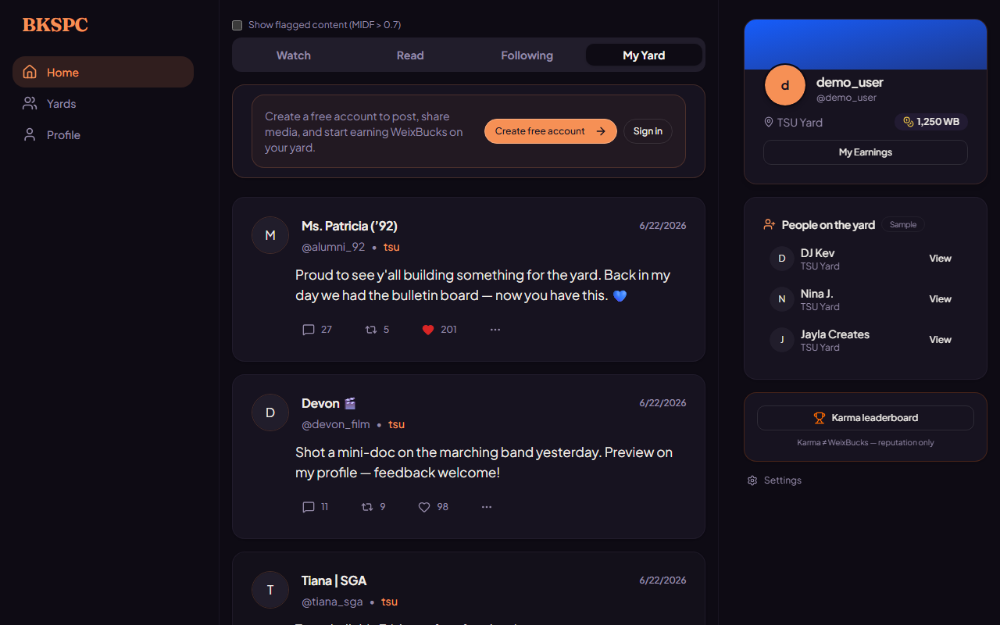
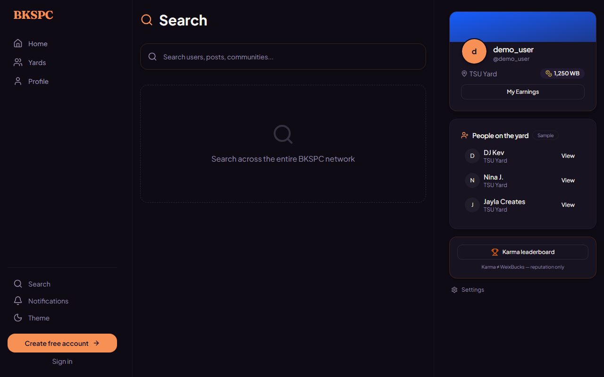
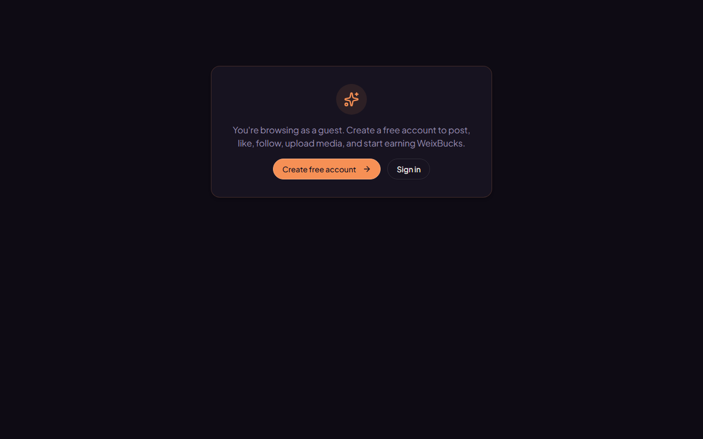
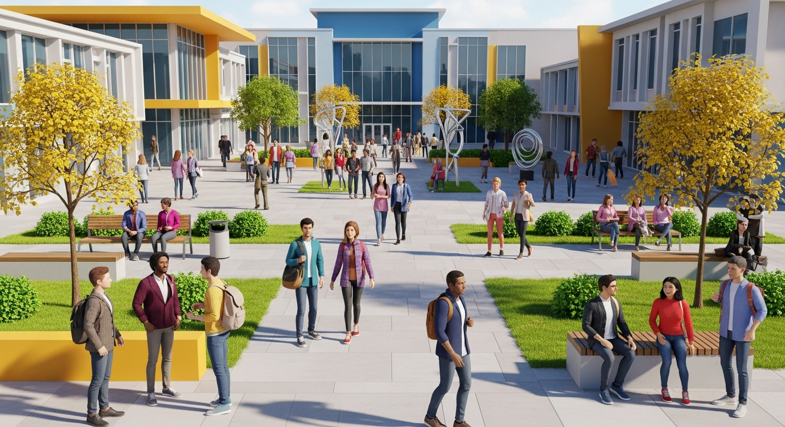

# BKSPC · BlkSpace

<p align="center">
  
</p>

<p align="center">
  <strong>The digital yard for HBCU students</strong><br/>
  Post on your campus · Customize MySpace-style · Earn WeixBucks<br/>
  <em>One app · every major OS · Tier&nbsp;0 hardware first</em>
</p>

<p align="center">
  <a href="https://github.com/er1cbrown/BlkSpace/releases"></a>
  <a href="https://github.com/er1cbrown/BlkSpace/actions"></a>
  
  
  
  
</p>

---

## Look at the product (not just the docs)

| Welcome · guest or account | Yard feed · works on cheap hardware |
|:---:|:---:|
|  |  |

| Search the network | Guest-safe wallet gate |
|:---:|:---:|
|  |  |

<p align="center">
  
</p>

> **Why this matters:** BlkSpace is designed for *shitty hardware on purpose* — 4–8&nbsp;GB laptops that students actually use. Prove it on the weakest machine; ship the **same product** on Windows, Mac, and Linux.

---

## Every OS (desktop today · mobile next)

BlkSpace is a **Tauri 2** app: one React UI + one Rust core, packaged natively per platform. CI builds **Yard** and **Full** on all three desktops every push to `main`.

| OS | Yard (students) | Full (labs) | CI runners | Status |
|----|-----------------|-------------|------------|--------|
| **Windows** x64 | `.msi` | `.msi` | `windows-latest` | ✅ Primary Tier 0 path |
| **macOS** Apple Silicon + Intel | `.dmg` (arm64 + x64 on release tags) | `.dmg` | `macos-latest` | ✅ MacBook-ready |
| **Linux** x64 | `.AppImage` | `.AppImage` | `ubuntu-latest` | ✅ AppImage |
| **Web preview** | Browser (`pnpm dev`) | same | any OS | ✅ UI/dev only (no local Turso) |
| **iOS / Android** | Tauri mobile | — | planned | ⬜ After Yard desktop is solid |

**Same codebase.** Installers differ only by OS package format — not a separate “Windows app” and “Mac app.”

```
         ┌─────────────────────────────────────┐
         │     React UI  (identical on all)    │
         └─────────────────┬───────────────────┘
                           │
         ┌─────────────────▼───────────────────┐
         │  Tauri + Rust  ·  Turso local DB    │
         │  Nostr mesh    ·  optional Iroh     │
         └──────┬──────────┬──────────┬────────┘
                │          │          │
            Windows      macOS      Linux
             .msi         .dmg     .AppImage
```

---

## Download (students & demos)

1. Open **[Releases](https://github.com/er1cbrown/BlkSpace/releases)** or the latest green **[CI](https://github.com/er1cbrown/BlkSpace/actions)** run → **Artifacts**  
2. Grab the build for **your** machine:

| Platform | Yard (students / Tier 0) | Full (labs / creators) |
|----------|--------------------------|-------------------------|
| **Windows** | `BlkSpace-Yard-Windows-x64.msi` | `BlkSpace-Full-Windows-x64.msi` |
| **macOS** (CI) | `BlkSpace-Yard-macOS.dmg` | `BlkSpace-Full-macOS.dmg` |
| **macOS** (tagged release) | `…-macOS-arm64.dmg` + `…-macOS-x64.dmg` | same |
| **Linux** | `BlkSpace-Yard-Linux.AppImage` | `BlkSpace-Full-Linux.AppImage` |

3. Install → read [`FIRST_RUN.md`](FIRST_RUN.md) (save your **12-word recovery phrase**).

| Device | What to do |
|--------|------------|
| **MacBook** | CI artifact `BlkSpace-Yard-macos-latest` or clone + `pnpm tauri:dev:tier0` |
| **Windows Tier 0** | Prefer **Yard** `.msi` — no Iroh, smaller, faster boot |
| **Linux lab** | `.AppImage` — chmod +x and run |

Student guide: [`TIER0_USER.md`](TIER0_USER.md)

---

## Progress review (Aug 2026)

```
Cross-platform desktop   █████████░  ~90%   Win + macOS + Linux CI (Yard & Full)
Yard MVP                 ████████░░  ~80%   install → feed → profile → yards → wallet
UI / UX                  █████████░  ~90%   dark theme, guest mode, MyYard, search
Data (Turso)             ████████░░  ~85%   embedded local DB, Tier 0 PRAGMAs
Economy                  ████░░░░░░  ~40%   WeixBucks local · BKSPC devnet scaffold
Mesh                     ██████░░░░  ~60%   Nostr + optional Iroh (Full only)
Mobile (iOS/Android)     ██░░░░░░░░  ~10%   Tauri mobile path planned, not shipping
```

| Area | Status | Multi-OS note |
|------|--------|----------------|
| Auth · recovery · guest browse | ✅ | Same UX on all desktops |
| Feed (Watch / Read / Following / My Yard) | ✅ | Proven on Tier 0 Windows; UI identical elsewhere |
| Profile · themes · people on the yard | ✅ | — |
| Search | ✅ | — |
| Wallet (WeixBucks) | ✅ | Guest-gated; local Turso on desktop |
| Tier 0 boot | ✅ | Deferred seed, lite UI, no Iroh in Yard |
| **Turso embedded DB** | ✅ | One engine, all OS packages |
| **Yard CI** Win / Mac / Linux | ✅ | `build-tauri-yard` matrix |
| **Full CI** Win / Mac / Linux | ✅ | `build-tauri-full` matrix |
| **Release tags** arm64 + x64 Mac | ✅ | `release.yml` dual mac targets |
| Device B student sign-off | ⏳ | [`docs/YARD_RELEASE_CHECKLIST.md`](docs/YARD_RELEASE_CHECKLIST.md) |
| BKSPC on-chain E2E | 🟡 | Devnet scaffold; NFT transfer pending |
| iOS / Android installers | ⬜ | After desktop Yard is tagged |
| Phase 5 NLP / anti-abuse | ⬜ | After Yard is stable |

**Next milestones**
1. **Device B** smoke on Tier 0 Windows → tag **`v0.1.0-yard`**.  
2. **Credibility layer — ProjectConnectBKSPC** (orgs, opportunities, Yard Cred) **before** mainnet coin — [spec](docs/features/project-connect-credibility-layer.md).  
3. Phase 4 marketplace / **BKSPC (BlkSpace Coin)** settlement only after Cred gates.  
4. Mobile (iOS/Android) after desktop multi-OS is trusted.

Full roadmap: [`docs/ROADMAP.md`](docs/ROADMAP.md) · Dashboard: [`docs/phase-0-status.md`](docs/phase-0-status.md)

---

## Stack

| Layer | Tech |
|-------|------|
| Desktop | **Tauri 2** (Windows · macOS · Linux) |
| UI | **React** + TypeScript + Tailwind |
| Local DB | **Turso** (SQLite-compatible, embedded, Tier 0 cache) |
| Social mesh | **Nostr** events |
| Media mesh | **Iroh** blobs (Full build) |
| Settlement | **Solana** / Anchor (devnet experiments) |

---

## Develop

```bash
git clone https://github.com/er1cbrown/BlkSpace.git
cd BlkSpace/Code-Companion
pnpm install

# Fast UI (web only — no Rust)
pnpm dev
# → http://localhost:24442  (defaults PORT/BASE_PATH)

# Tier 0 desktop (Turso, no Iroh) — Windows / Mac / Linux
cd artifacts/blkspace
pnpm tauri:dev:tier0
pnpm tauri:build:tier0
```

| You are… | Start here |
|----------|------------|
| Student / alum | [`TIER0_USER.md`](TIER0_USER.md) |
| New contributor | [`STARTUP.md`](STARTUP.md) · [`INSTALL.md`](INSTALL.md) |
| Agent / CI | [`AGENTS.md`](AGENTS.md) · [`DEVOPS.md`](DEVOPS.md) |
| Investor | [`THEORY.md`](THEORY.md) |

CI builds installers — push to `main` and download artifacts if your laptop is low on RAM/disk.

---

## Two builds

| | **Yard** | **Full** |
|--|----------|----------|
| Who | Students, 4–8 GB laptops | Labs, creators |
| Flags | `--no-default-features` | default + Iroh |
| UI | `VITE_TIER0_LITE=1`, yard-first | Bridge, trending, full mesh |
| Artifact | `BlkSpace-Yard-*` | `BlkSpace-Full-*` |

---

## Repo map

```
BlkSpace/
├── README.md                 ← this page (UI + progress)
├── docs/assets/screenshots/  ← live product shots
├── Code-Companion/artifacts/blkspace/   React + Tauri app
├── docs/                     architecture · economy · testing
└── .github/workflows/        CI + release installers
```

---

## Contributing (future builders)

1. Open an issue or pick something from [`docs/ROADMAP.md`](docs/ROADMAP.md).  
2. Keep **Tier 0** sacred — no mandatory feature that dies on a 4 GB Windows laptop.  
3. Prefer `pnpm tauri:dev:tier0` for desktop work.  
4. Screenshots: `node artifacts/blkspace/scripts/capture-readme-shots.mjs` (with `pnpm dev` running).  
5. Push to a branch → PR → CI must stay green.

---

## Links

- [Releases (download)](https://github.com/er1cbrown/BlkSpace/releases)  
- [CI Actions](https://github.com/er1cbrown/BlkSpace/actions)  
- [Docs index](docs/README.md) · [Security](docs/security-considerations.md) · [Tokenomics](docs/tokenomics-policy.md)

<p align="center">
  <sub>Built for the yard · Runs on the hardware you already have</sub>
</p>
