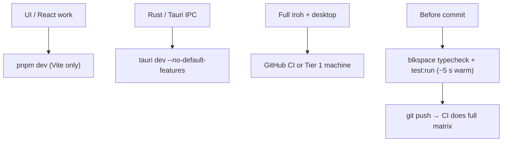

# Tier 0 Dev Runtime — Performance Notes

**Date:** June 22, 2026  
**Context:** BlkSpace dev on Tier 0 hardware (top of 4–8 GB RAM range per `FLESHTHEORY.md`)  
**Machine profile (local):** 8 GB RAM, 8 cores

---

## Diagnosis: cold start, not steady state

The painful waits are almost entirely **cold-cache dev toolchain** cost, not slow app logic.

Measured on this machine:

| Step | Cold (first run) | Warm (cached) | What changed |
|------|------------------|---------------|--------------|
| `tsc` (blkspace only) | ~7 min | **2.7 s** | `.tsbuildinfo` exists |
| Vitest (22 tests) | ~545 s | **1.5 s** | Vite module graph cached |
| Rust role tests | ~6 s compile + 0.3 s run | ~4.5 s compile | incremental `target/` |

Warm runs are fine. Cold runs thrash because **disk + RAM** can't hold the full build graph at once.

**Faster dev boot (Tier 0 lite):**

```bash
cd Code-Companion/artifacts/blkspace
pnpm dev:tier0          # web — lite UI, local tab default, pre-warmed Vite graph
pnpm tauri:dev:tier0    # desktop — same + deferred Rust seed/relays
```

Use `serve:tier0` or a release `.msi` for daily use on 4–8 GB machines — not `pnpm dev`.

---

## Complexity breakdown

### Time complexity (dev commands)

```
pnpm typecheck (workspace)
  └─ O(P × F)  P = packages (5), F = files + transitive types per package
     Project references force libs → artifacts/blkspace chain

vitest run (cold)
  └─ O(M)  M = modules in import graph from test entry points
     use-app-data.test → hooks → api-client-react → heavy collect phase

cargo build (with iroh default)
  └─ O(C × R)  C ≈ 400+ crates, R = RAM pressure multiplier when swapping
     Link step blows up when target/ (18 GB) competes with 8 GB RAM
```

### Space complexity (what's eating the machine)

| Asset | Size | Impact on Tier 0 |
|-------|------|------------------|
| `src-tauri/target/` | **18 GB** (12 GB in `debug/deps`) | Link/compile swaps to disk → 10× slower |
| `node_modules` (workspace) | 64 MB | Fine |
| `.tsbuildinfo` | 499 KB | Saves ~7 min → 3 s on repeat |
| App source (`src/`) | 960 KB, ~20k LOC | Not the bottleneck |

**Root cause:** Iroh default feature pulls ~300 Rust crates. On 8 GB RAM, the linker fights the OS for memory. TypeScript and Vitest are slow **once** until caches exist; Rust stays expensive every time you touch backend code with Iroh enabled.

### App runtime (actual product)

`tier0_benchmark.rs` defines Tier 0 targets:

- Feed (50 posts): **< 2 s**
- Post create: **< 1 s**
- Blob round-trip (512 KiB): **< 30 s**

Run `pnpm test:tier0` to measure. Dev toolchain slowness ≠ user-facing slowness — but swap thrashing during dev *does* make the machine feel unusable.

---

## How to create faster runtimes

Think in three layers: **workflow**, **config**, **architecture**.

### 1. Workflow (biggest win, zero code changes)

**Default daily loop — frontend only:**

```bash
cd Code-Companion && pnpm dev   # Vite web preview, ~200 MB, no Rust
```

Use `make dev-web`. Only open Tauri when touching Rust commands.

**Scope commands to what you're editing:**

```bash
# Typecheck one package (~3 s warm), not whole workspace (~7 min cold)
cd Code-Companion/artifacts/blkspace && pnpm typecheck

# Tests (~1.5 s warm)
cd Code-Companion/artifacts/blkspace && pnpm test:run
```

**Never casually run `make clean`** — it deletes `target/` and all warm caches. Next build is a full cold start.

**Push heavy builds to CI** — multi-OS Tauri + Iroh builds already run in GitHub Actions. Don't `pnpm tauri build` locally on Tier 0 unless you must.

**Keep one terminal session warm** — second `tsc`/vitest runs are ~100× faster.

### 2. Config (medium effort, high payoff)

**Rust — slim local builds:**

```bash
# Drop ~300 crates locally; UI still works (cid=hash fallback)
cd Code-Companion/artifacts/blkspace
pnpm tauri:build:no-iroh
# or: cargo build --manifest-path src-tauri/Cargo.toml --no-default-features
```

**Rust — cap parallelism on 8 GB RAM:**

```bash
export CARGO_BUILD_JOBS=2   # not 8 — avoids swap storms
```

**Rust — optional `Code-Companion/artifacts/blkspace/src-tauri/.cargo/config.toml`:**

```toml
[build]
incremental = true

[profile.dev]
debug = 1          # less debug info → faster link
split-debuginfo = "unpacked"

[profile.dev.package."*"]
opt-level = 0
```

**TypeScript — add fast Makefile targets:**

```makefile
typecheck-fast:
	cd $(CC)/artifacts/blkspace && pnpm typecheck

test-fast:
	cd $(CC)/artifacts/blkspace && pnpm test:run
```

**Vitest** — already fast when warm (794 ms). Cold slowness is Vite transforming the full `use-app-data` → `api-client-react` graph. Mitigations:

- Don't run full test suite on every save; run on commit
- Consider `pool: "forks"` only if threads leak memory on long sessions
- Mock `@workspace/api-client-react` at the top of heavy test files to shrink collect graph

### 3. Architecture (Tier 0 product runtime)

| Area | Current | Tier 0 recommendation |
|------|---------|----------------------|
| Iroh | Default on in `Cargo.toml` | **Off by default for Tier 0 dev builds**; enable in CI / Tier 1+ |
| Tauri dev | Full desktop + Rust | Web preview for UI; Tauri only for IPC testing |
| Sessions | In-memory | Persist to SQLite (fewer re-auth round-trips) |
| Routes | `React.lazy` already | Good — keep heavy pages lazy |
| SQLite | Indexed queries | Run `test:tier0` to verify feed < 2 s on this hardware |

---

## Recommended Tier 0 dev profile



---

## Next steps (ordered by impact)

1. **Adopt scoped commands** — `blkspace` typecheck/test only; stop running workspace-wide cold checks locally.
2. **Use `dev-web` as default** — reserve Tauri for Rust days.
3. **Build without Iroh locally** — cuts compile graph ~70%; biggest RAM win.
4. **Set `CARGO_BUILD_JOBS=2`** in your shell profile on 8 GB machines.
5. **Add `typecheck-fast` / `test-fast` Makefile targets** — documents the Tier 0 workflow.
6. **Run `pnpm test:tier0`** — establish app-runtime baseline on target hardware.
7. **Consider flipping Iroh off by default in `Cargo.toml`** for local dev (CI keeps explicit `--features iroh` job).

---

## Bottom line

You're not fighting slow algorithms — you're fighting **cold-cache, full-workspace, Iroh-heavy builds on 8 GB RAM**. Warm runs prove the toolchain is fine once primed (tsc **2.7 s**, vitest **1.5 s**). The Tier 0 strategy is: **narrow scope, keep caches warm, slim Rust features locally, full matrix in CI**.