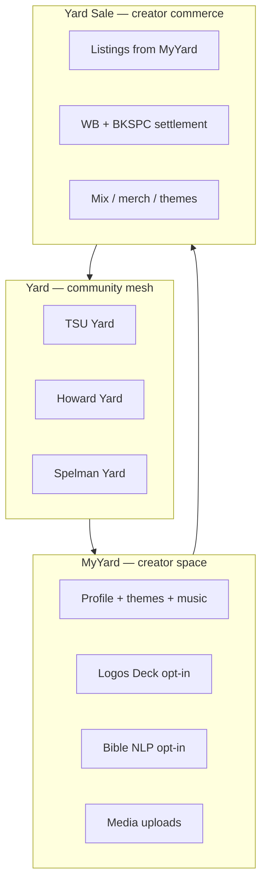

# MyYard, Yard Sale, and Per-Mesh Customization

**Status:** Product architecture (June 2026)  
**Replaces user-facing "MySpace" branding** — internal theme key `myspace` remains for DB compatibility.

---

## The three layers

BlkSpace is an **amalgamation network**: each layer does one job, but together they feel like one customizable, profitable, broadcastable social space.

| Layer | What it is | Who sees it | Distinct per… |
|-------|------------|-------------|---------------|
| **Yard** | Campus / town mesh (Nostr town tags, relay scope) | Everyone in that community | Mascots, colors, norms, events — **preview** until a campus pack sells on Yard Sale, then **live** for all |
| **MyYard** | Your personal creator profile (was "MySpace" in UI) | Visitors + you | Themes, Top 8, profile song, pro JSON, optional modules |
| **Yard Sale** | Marketplace tied to creator identity | Buyers across yards | Listings from *your* MyYard inventory |

**Key idea:** One mesh having Bible NLP or DJ mixes does **not** mean the next mesh does. Same for individuals — your MyYard is not TSU's default Yard skin.

---

## MyYard (personal creator space)

**Purpose:** Express identity, host content, and wire optional creative verticals without forcing them on every user.

### Shipped today
- Profile tabs: Grid, Wall, Posts, Pro, Music, **MyYard** customize
- Themes: Classic HBCU, Pro, Vibrant Yard, MyYard Classic (internal `myspace`)
- Profile song (Iroh audio blob)
- Top 8 friends, wall approval, Nostr kind 0 metadata

### Roadmap modules (opt-in per user)

| Module | Spec | Phase | Monetization |
|--------|------|-------|--------------|
| **Logos Deck** | [`logos-decks.md`](logos-decks.md) — scripture as DJ library | 5 (stub metadata Phase 2) | Publish sermon sets; WB for engagement; no forced WB on scripture |
| **Bible NLP** | [`bible-nlp-opt-in-draft.md`](../bible-nlp-opt-in-draft.md) — on-device, separate graph | 5 | No WB on religious content; optional study tags |
| **DJ / mix publishing** | Mix metadata + kind 30078 | 4 | Yard Sale listings, NFT mint path |
| **Theme packs** | Sellable profile/community skins | 4+ | Yard Sale `itemType: theme` |

MyYard customize tab is the **control panel** for which modules are visible on your public profile.

---

## Yard Sale (marketplace)

**Purpose:** Sell goods *from* your MyYard to other creators and fans — the "yard sale" metaphor (neighborhood commerce, not Amazon).

### Shipped today
- Wallet → **Yard Sale** tab (`CreatorMarketplacePanel`)
- List: media, mixes, services, tickets
- Pay: WB (simulated) or BKSPC burn (devnet build)
- Platform fee from tokenomics policy

### Future
- List **theme packs** and **Logos Deck sets** as first-class item types
- Cross-yard discovery: "TSU Yard Sale" vs global creator search
- In-app currencies: WB (everyday), BKSPC (on-chain), karma (ranking only) — see [`reward-formulas.md`](../reward-formulas.md)

---

## Per-mesh vs per-user customization

| Dimension | Yard (mesh) | MyYard (user) |
|-----------|-------------|---------------|
| Colors / mascot | Community defaults, events panel | User theme override |
| Feed norms | Town-tagged relay scope | User posts + wall |
| Commerce | Community events, group listings (future) | Personal Yard Sale inventory |
| Optional features | Campus can *promote* Logos Deck channel | User opts in on profile |

**Implementation pattern:** Store yard-level config in `yards` table + Nostr community metadata; store user-level config in SQLite `profile_customization` + kind 0 tags. Never merge the two graphs for Bible NLP (separate interest graph per spec).

---

## Broadcast and interaction

1. **Publish** — post, mix, or Yard Sale listing → Nostr + optional Iroh CID  
2. **Broadcast** — relays + town tags; Full mesh for viral CIDs (`BLKSPACE_FULL_MESH=1`)  
3. **Interact** — follow, wall, buy, tip (WB), boost  
4. **Profit** — seller net on Yard Sale; node rewards for harvest; future theme resale  

Visitors experience: land on **MyYard** → hear profile song → browse Grid/Wall → open **Yard Sale** listings → follow into your **Yard** community context.

---

## Naming (release-safe)

| Old (avoid in UI) | New (ship) |
|-------------------|------------|
| MySpace | **MyYard** |
| Marketplace (user-facing) | **Yard Sale** |
| Community | **Yard** (unchanged) |

Internal code may keep `myspace` theme id, `marketplace_*` commands, and `CreatorMarketplacePanel` until a breaking migration is scheduled.

---

## Next implementation steps

1. ✅ User-facing MyYard + Yard Sale rename  
2. ✅ MyYard customize: module stubs (Logos Deck, Bible NLP)  
3. ✅ Yard Sale: `theme`, `mix`, `logos-deck` listing types + `town_tag` per campus  
4. ✅ Campus yard theme packs on community pages + per-yard Yard Sale tab  
5. ✅ Persist MyYard module toggles (`profile_layout_json`); apply purchased themes / Logos Deck on buy  
6. ✅ Logos Deck player UI on public MyYard when module enabled  
7. ✅ Campus pack purchase activates community yard skin (`community_yard_packs` table)  
8. Device B + `v0.1.0-yard` — students get Yard build; labs get Full + optional modules  

See [`ROADMAP.md`](../ROADMAP.md) for milestone order.