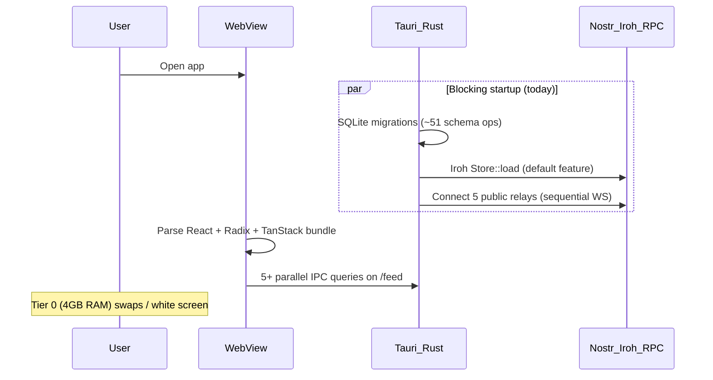

# Tier 0 Load-Time Optimization Plan

**Status:** Tier A implemented (June 2026)  
**Context:** BlkSpace feels unusably slow on Tier 0 hardware (4–8 GB RAM, older Intel/AMD). This document captures why, how mainstream social apps differ, and a phased fix plan.

---

## Why it feels like "5 years"

BlkSpace currently does **everything at once** on first paint. Mainstream social apps do the opposite: show a feed shell in <1s, then hydrate features in the background.



### Root causes (mapped to code)

| Layer | Problem | Where |
|-------|---------|-------|
| **Tauri cold start** | Iroh node loads **before** window (`block_on`) | `Code-Companion/artifacts/blkspace/src-tauri/src/lib.rs` ~3371–3398 |
| **Tauri cold start** | Connects to **5 public Nostr relays** synchronously on boot | `Code-Companion/artifacts/blkspace/src-tauri/src/relay_manager.rs` `DEFAULT_RELAYS` |
| **Tauri binary** | `default = ["iroh"]` adds ~300 transitive crates + larger binary | `Code-Companion/artifacts/blkspace/src-tauri/Cargo.toml` |
| **Feed first paint** | `/feed` fires **all** queries on mount (posts, trending, combined feed, following, reposts) even when tab is `watch` | `Code-Companion/artifacts/blkspace/src/pages/feed.tsx` ~88–106 |
| **Feed JS weight** | `WatchFeed`, `ReadFeed`, `BridgeFeed`, dialogs, badges imported eagerly | `Code-Companion/artifacts/blkspace/src/pages/feed.tsx` top imports |
| **Hook monolith** | `use-app-data.ts` (~1500 lines) pulls full `@workspace/api-client-react` into every page using any hook | single file |
| **UI dependency surface** | 20+ `@radix-ui/*` packages, `lucide-react`, `framer-motion`, `recharts` in workspace | `Code-Companion/artifacts/blkspace/package.json` |
| **Web dev mode** | `pnpm dev` = unbundled Vite transforms (worst on Tier 0); docs assume ~200MB but dev HMR is much heavier | `AGENTS.md` Windows workflow |
| **Recent marketplace work** | Solana chunks isolated to `/wallet` (good), but marketplace panel still loads wallet stack when visiting wallet | `Code-Companion/artifacts/blkspace/src/pages/wallet.tsx` |

### Tier 0 targets already defined (use as gates)

From `tier0_benchmark.rs` and `docs/device-b-m0-results.md`:

- Feed load (50 posts): **< 2s**
- Post creation: **< 1s**
- Blob round-trip (512 KiB): **< 30s**
- Web: parse Solana only on `/wallet` (documented in `docs/solana-blueprint.md` §4.1)

---

## How mainstream social networks differ

| Pattern | TikTok / Instagram / X | BlkSpace today | Tier 0 fix |
|---------|------------------------|----------------|------------|
| **First screen** | Skeleton feed + 1 API call | Full app shell + 5+ IPC/API calls | Yard shell + 1 query |
| **Protocol stack** | 1 backend (their CDN/API) | SQLite + Nostr + Iroh + optional Solana | Lazy-init each protocol |
| **Media** | CDN transcode, progressive video | Blob fetch via Tauri/Iroh per hash | Keep 8MB gate (`media-display.tsx`); add poster thumbs |
| **Scroll** | Virtualized lists | Render up to 12 cards (ok) but heavy badges per card | Strip badges on Tier 0 / lazy tab panels |
| **Web3** | None on feed | Wallet isolated but wallet route still heavy | Tauri-proxy RPC (per blueprint) |
| **Offline** | Cache last feed | OfflineSyncProvider + relay poll | Defer relay connect until online + user action |

BlkSpace cannot match TikTok's CDN without infrastructure spend — but it **can** match their *startup shape*: thin shell first, mesh/Web3 second.

---

## Optimization strategy (3 tiers)

### Tier A — "Yard boots" (1–2 days, highest ROI)

**Goal:** User sees `/feed` shell in <3s on Tier 0 web prod + Tauri installed.

1. **Lazy-init heavy Rust subsystems** in `lib.rs`:
   - Move `IrohNode::new` and `connect_to_default_relays` out of `run()` blocking path → spawn after window `setup`, gated by user setting or first upload.
   - Add `startup_mode: YardOnly | FullMesh` in app config (default `YardOnly` on machines with <8GB RAM or env `BLKSPACE_TIER0=1`).

2. **Tab-gated queries** in `feed.tsx`:
   - `useTauriCombinedFeed`: `enabled: IS_TAURI && activeTab === 'bridge'`
   - `useAppGetTrendingFeed`: only when tab needs FYP (`watch`/`read`/`trending`)
   - `useTauriFollowingReposts`: only when `activeTab === 'following'`
   - `useTauriGetFollowing`: defer until following tab or composer needs it

3. **Lazy-load feed panels** (dynamic `import()`):
   - `WatchFeed`, `ReadFeed`, `BridgeFeed`, `StoryStrip` — load only for active tab
   - Reduces initial JS parse on all surfaces

4. **Split `use-app-data.ts`** into domain modules (`use-feed.ts`, `use-wallet.ts`, `use-marketplace.ts`) so `/feed` doesn't import marketplace/wallet hooks transitively.

5. **Ship Tier 0 web build flavor**:
   - Add `pnpm build:tier0` script: production Vite build (not dev), `BETA_FEATURES` extended with `tier0Lite: true` hiding bridge/trending/relay panels by default (`beta-features.ts`)
   - Document: **never use `pnpm dev` on Tier 0 for daily use** — use `pnpm build && pnpm serve` or CI artifact

### Tier B — "Feels like a social app" (3–5 days)

1. **Build profiles for Tauri** (align with `AGENTS.md`):
   - `tier0` default release: `--no-default-features` (no Iroh), no `bkspc-devnet`
   - `full` profile: `iroh` + `bkspc-devnet` for power users
   - CI produces both `.msi` artifacts; Tier 0 users install `BlkSpace-Yard.msi`

2. **Expand Vite chunking** in `vite.config.ts`:
   - Separate chunks: `feed`, `wallet-vendor` (exists), `communities`, `ui-radix`
   - Add `rollup-plugin-visualizer` in CI to enforce budget (e.g. initial < 350KB gzip)

3. **Relay connection policy** in `relay_manager.rs`:
   - Start with **1 relay** (TSU/local), connect others on demand
   - Parallelize connects with timeout (don't block startup on slow relays)

4. **Virtualize + paginate feed** per `docs/TOP_DOWN_APPROACH.md` ("pagination, not infinite scroll"):
   - `list_posts` LIMIT 20 + cursor; frontend `react-window` or simple "Load more"
   - Stops SQLite + DOM growth on old hardware

5. **Solana via Tauri proxy** (blueprint §4.1):
   - Move `burnBkspcForPurchase` RPC calls from `bkspc-marketplace.ts` to existing Rust settlement module — browser never opens Solana WebSocket

### Tier C — "Ecosystem parity" (ongoing)

1. **Progressive media pipeline**: generate 240p poster + audio preview on upload (Rust thumbnail job), feed loads posters first
2. **Service worker + feed cache** for web preview (read-only yard, stale-while-revalidate)
3. **Startup telemetry**: extend `tier0_benchmark.rs` with cold-start ms + JS bundle parse time; gate CI on regression
4. **Radix diet**: replace rarely-used primitives with native HTML on Tier 0 paths (dropdowns on feed cards)

---

## Recommended execution order


**If you only do three things:** (1) defer Iroh/relay startup, (2) tab-gated feed queries, (3) production build instead of `pnpm dev` on Tier 0.

---

## Success metrics

| Metric | Current (est.) | Target |
|--------|----------------|--------|
| Tauri window visible | 10–30s+ (Iroh + 5 relays) | < 3s |
| `/feed` interactive (web prod) | 5–15s parse + queries | < 3s |
| Initial JS (gzip) | unmeasured | < 350KB |
| IPC calls on feed mount | 5+ | 1–2 |
| Tier 0 benchmark | manual | all pass on Device B |

---

## Files to touch first

- `Code-Companion/artifacts/blkspace/src-tauri/src/lib.rs` — deferred startup
- `Code-Companion/artifacts/blkspace/src/pages/feed.tsx` — query gating + lazy panels
- `Code-Companion/artifacts/blkspace/src/lib/beta-features.ts` — `tier0Lite` profile
- `Code-Companion/artifacts/blkspace/vite.config.ts` — chunk budgets
- `Code-Companion/artifacts/blkspace/src-tauri/Cargo.toml` — `tier0` feature profile
- `Code-Companion/artifacts/blkspace/package.json` — `build:tier0` script

---

## Implementation todos

- [x] Move Iroh init + default relay connect off blocking `run()` path; yard-first default (`BLKSPACE_FULL_MESH=1` for eager mesh)
- [x] Gate feed.tsx React Query hooks by activeTab; lazy-import WatchFeed/ReadFeed/BridgeFeed/StoryStrip
- [x] Feed-route hook barrel (`use-feed-data.ts`) + `enabled` params on list/trending/combined queries
- [x] Tier0 Vite + Tauri scripts (`build:tier0`, `serve:tier0`, `tauri:build:tier0`) + `tier0Lite` beta flags
- [x] Add cursor/limit to list_posts + Load more UI (20 posts/page, `before_id` cursor)
- [x] Solana Tauri proxy for BKSPC burns (`prepare_bkspc_burn_transaction` / `submit_bkspc_burn_transaction`)
- [x] Schema-versioned SQLite migrations (skip ~20 ALTER TABLE on warm boot) + WAL PRAGMAs
- [x] Defer demo DB seed to background thread (window no longer waits on INSERT batch)
- [x] Relay parallel connect + 6s timeout per relay (full mesh); yard mode 300ms defer
- [x] Feed default tab `local` in tier0Lite; defer AppShell user IPC + offline flush (3s)
- [x] Vite `optimizeDeps` + `server.warmup`; `dev:tier0` / `tauri:dev:tier0` scripts
- [x] Tier 0 bundle budget gate in CI (`check:bundle:tier0` — entry + total JS gzip limits)
- [ ] Extend tier0_benchmark with cold-start metrics; optional rollup visualizer artifact
- [x] CI Yard artifacts (`BlkSpace-Yard-Windows-x64.msi`, macOS dmg, Linux AppImage) via `build-tauri-yard` job
- [x] CI dual release artifacts (`BlkSpace-Full-*` with Iroh for power users) via `build-tauri-full` (Tier B)

## Tier 0 usage (after Tier A)

**Web on low-end hardware** — do not use `pnpm dev` for daily use:

```bash
cd Code-Companion/artifacts/blkspace
pnpm serve:tier0   # build with VITE_TIER0_LITE=1 + preview
```

**Tauri yard build** (no Iroh, faster binary):

```bash
pnpm tauri:build:tier0
```

**Full mesh** (all relays + deferred Iroh still backgrounded):

```bash
BLKSPACE_FULL_MESH=1 pnpm tauri:dev
```